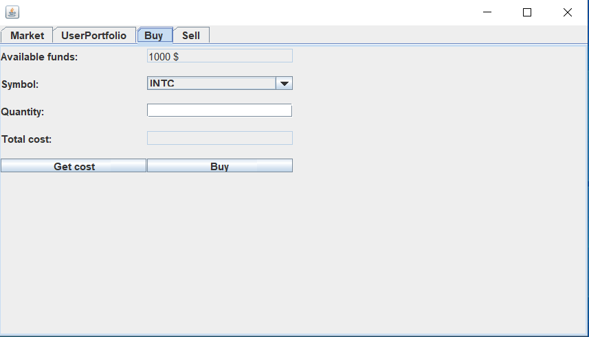

# 📈 Stocks Portfolio Management Application 📉

**Note:** The project uses Lombok. 

## Implementing a basic stock portfolio tracker application. 🚀

The application should provide the following functionalities:

- **Authentication (Login):** Finish the login implementation. Currently, the credentials are not verified; anyone can access the application.
  


- **Viewing market stocks and their current value:** (this feature is implemented)


- **View user portfolio owned stocks:**
    - View owned stocks in a table view similar to Market;
    - For each owned stock display in the table following: symbol, quantity, price per unit, total price of the position;
    - Also, add available funds (cash).


- **Buy stock:**
    - Implementing "Buy" button functionality;
    - Buy is limited by available cash funds (stored in Portfolio class, attribute "cash");



- **Sell stock:**
    - Creating a user interface similar to the Buy interface;
    - Symbol dropdown button should display only stocks owned by the user;
    - When the sell is completed, the available funds should increase with the value of the transaction;


### Implementation notes 📝

**Note 1:** Stock symbols are hardcoded in `StockMarketQueryService` private `String[] symbols = new String[] {"INTC", "BABA", "TSLA", "AIR.PA", "MSFT", "AAPL", etc.}`. An own symbol can be added as long as it corresponds to some real market symbols.

**Note 2:** For getting financial market information, the application uses the `https://financequotes-api.com/` library:

```xml
<dependency>
    <groupId>com.yahoofinance-api</groupId>
    <artifactId>YahooFinanceAPI</artifactId>
    <version>3.15.0</version>
</dependency>
